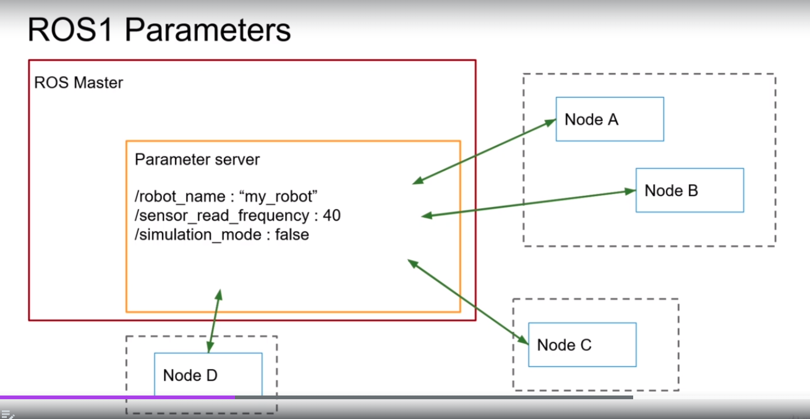

# ROS2 course

### Summary
ROS1 to ROS2 transition course tips and examples to migrate projects.

## Table of Contents
 - [Setup](#setup)
 - [Ros2](#ros2)
    - [Create pkgs](#create-pkgs)
    - [Compile and install](#compile-and-install)
    - [Run](#run)
      - [ros-args](#ros-args)
      - [Launch files (ROS2 bringup)](#launch-files-ros2-bringup)
    - [ros1_bridge](#ros1_bridge)
      - [Simple case, default bridge](#simple-case-default-bridge)
      - [Bridge with custom msgs and services](#bridge-with-custom-msgs-and-services)
        - [Setup ROS1 and ROS2 packages](#setup-ros1-and-ros2-packages)
        - [Setup ros1_bridge and run](#setup-ros1_bridge-and-run)
- [ROS1 to ROS2 migration](#ros1-to-ros2-migration)
- [Troubleshooting](#troubleshooting)
----


## Setup
  ### Clone the repo
  ```sh
  cd
  git clone https://github.com/janoloman/ros2_course
  ```

  ### Prerequisites
  Install ROS2, based on [ROS2 Foxy install Ubuntu Debian](https://docs.ros.org/en/foxy/Installation/Ubuntu-Install-Debians.html)
  ```sh
  # setup sources
  sudo apt update && sudo apt install curl gnupg2 lsb-release
  sudo curl -sSL https://raw.githubusercontent.com/ros/rosdistro/master/ros.key  -o /usr/share/keyrings/ros-archive-keyring.gpg
  echo "deb [arch=$(dpkg --print-architecture) signed-by=/usr/share/keyrings/ros-archive-keyring.gpg] http://packages.ros.org/ros2/ubuntu $(source /etc/os-release && echo $UBUNTU_CODENAME) main" | sudo tee /etc/apt/sources.list.d/ros2.list > /dev/null

  # install
  sudo apt update
  sudo apt upgrade
  sudo apt install ros-foxy-desktop
  sudo apt install python3-colcon-common-extensions
  ```
  try some examples
  ``` sh
  # test env
  source /opt/ros/foxy/setup.bash
  ros2 run demo_nodes_cpp talker
  ```
  ``` sh
  # test env
  source /opt/ros/foxy/setup.bash
  ros2 run demo_nodes_cpp listener
  ```
  **(Optional) setup environment**
  ```sh
  # Environment setup
  echo "# ROS2 foxy" >> ~/.bashrc
  echo "source /opt/ros/foxy/setup.bash" >> ~/.bashrc
  echo "source $HOME/ros2_course/ros2_ws/install/setup.bash" >> ~/.bashrc
  echo "source /usr/share/colcon_argcomplete/hook/colcon-argcomplete.bash" >> ~/.bashrc
  source ~/.bashrc
  ```


## ROS2
  ### Create pkgs
  **Python**
  ```sh
  cd <ros2_ws>

  # Create a Python pkg
  ros2 pkg create <pkg_name_py> --build-type ament_python --dependencies rclpy std_msgs ...

  # Create scripts
  cd <pkg_name_py>/<pkg_name_py>
  touch <program_file>
  # make executable
  chmod +x <pkg_name_py>
  ```
  Setup
  Add your scripts to the 'setup.py' file inside the 'console_scripts' as follows:
  ``` python
  'console_scripts': [
              "<program_name> = <ros2_package>.<program_file>:<program_function>"
          ],

  ``` 
  Example: the `number_publisher` script will be *ros2_app_py pkg*->*number_publisher.py*->*Main function* 
  ``` python
  # example
          'console_scripts': [
              "number_publisher = ros2_app_py.number_publisher:main"
          ],
  ``` 
  **C++**
  ```sh
  # Create a C++ pkg
  ros2 pkg create <pkg_name_cpp> --build-type ament_cmake --dependencies rclcpp std_msgs
  ```

  ### Compile and install
  ```sh
  cd <ros2_ws>

  # standard build
  colcon build 

  # build a specific package
  colcon build --packages-select <pkg_name>
  ```
  *Python only* (pending): 
  If you don't want to build your python pakage every time you modify your files, then
  ```sh
  # build a specific package with symlink
  colcon build --packages-select <pkg_name_py> --symlink-install
  ```
  **Install** 
  ```sh
  # add WS to sourced ROS distro
  setup install/setup.bash

  # setup only local WS
  setup install/local_setup.bash 
  ```

  ### Run
  ```sh
  # run a ROS2 node
  ros2 run <pkg_name> <node_name>
  ```

  #### ros-args
  For renaming nodes, topics, services etc.
  ```sh
  # rename a node
  ros2 run <pkg_name> <node_name> --ros-args -r __node:=<another_name>

  # rename a topic
  ros2 run <pkg_name> <node_name> --ros-args -r __node:=<another_node_name> -r <topic_name>:=<another_topic_name>

  # rename a service
  ros2 run <pkg_name> <node_name> --ros-args -r __node:=<another_node_name> -r <service_name>:=<another_service_name>
  ```
  **ROS2 Parameters**
  ```sh
  # run a node and set a parameter
  ros2 run <pkg_name> <node_name> --ros-args -p <parameter_name>:=<parameter_value>
  ```
  You need to declare each parameter at the begining of the constructor class. The type and value of the parameter are set at runtime.

  | ROS1 parameters | ROS2 parameters |
  |-------------------|-----------------|
  |  |  |
  
  #### Launch files (ROS2 bringup)
  Changed from XML (ROS) to python (ROS2). You can create several launch and configuration files for different node into a single bringup package
  ```sh
  cd <ros2_ws>

  # create a bringup package
  ros2 pkg create <name>_bringup
  cd <name>_bringup

  # remove unused directories
  rm -rf include/ && rm -rf src/

  # create launch directory
  mkdir launch

  # create node launch files
  touch <node>.launch.py && chmod +x <node>.launch.py

  # install
  cd <ros2_ws> 
  colcon build --packages-select <name>_bringup
  source ~.bashrc

  # run
  ros2 launch <name>_bringup <node>.launch.py
  ```

  ### ros1_bridge 

  #### Simple case, default bridge
  Run your app with ROS1 and ROS2. First terminal: start ROS master
  ``` sh
  source /opt/ros/noetic/setup.bash && roscore
  ```
  second terminal: start ROS2 ros1_bridge
  ``` sh
  source /opt/ros/noetic/setup.bash && source /opt/ros/foxy/setup.bash
  # now you can run ros1_bridge
  ros2 run ros1_bridge dynamic_bridge --help
  ros2 run ros1_bridge dynamic_bridge --bridge-all-topics
  ```
  **test**
  Open 2 more terminals:
  ```sh
  # ROS1 env
  source /opt/ros/noetic/setup.bash
  rosrun rospy_tutorials talker
  ```
  ```sh
  # ROS2 env
  source /opt/ros/foxy/setup.bash
  ros2 run demo_nodes_cpp listener
  ```

  #### Bridge with custom msgs and services
  You need to **define mapping rules between workspaces (ROS1 and ROS2)**, the rules can be setted to map messages and services.

  Create a YAML file at your ROS2 package-message or package-service directory
  ```sh
  cd <ros2_ws>/src/<your_ros2_pkg>/<your_msgs_srvs>
  touch my_mapping_rules.yaml
  ```
  Add your mapping rules
  ```yaml
  -
  # messages mapping
    ros1_package_name: 'my_msgs'
    ros1_message_name: 'CustomString'

    ros2_package_name: 'my_msgs'
    ros2_message_name: 'MyCustomString'

  # services mapping
    ros1_package_name: 'my_msgs'
    ros2_package_name: 'my_interfaces'

  ```
  Add your mapping rules to `<your_ros2_pkg>/package.xml`
  ```xml
  ...
  <export>
      <build_type>ament_cmake</build_type>
      <ros1_bridge mapping_rules="my_mapping_rules.yaml" />
  </export>
  ...
  ```
  Add your mapping rules file to `<your_ros2_pkg>/CMakeLists.txt` as an aditional *install file* after the 'rosidl_generate_interfaces' section 
  ```cmake
  ...
  rosidl_generate_interfaces(${PROJECT_NAME}
    "msg/MyCustomStrinng.msg"
    "srv/ReseyCounter.srv"
  )

  install(FILES
    my_mapping_rules.yaml
    DESTINATION share/${PROJECT_NAME}/
  )
  ...
  ```

  ##### Setup ROS1 and ROS2 packages
  Open a new terminal, then compile and install your ROS1 package
  ```sh
  # source ROS1 globally
  source /opt/ros/noetic/setup.bash

  # compile local ROS1 package
  cd <ros1_ws>
  catkin_make
  ```
  Open a second terminal, then compile and install your ROS2 package 
  ```sh
  # source ROS2 globally
  source /opt/ros/foxy/setup.bash

  # compile local ROS2 package
  cd <ros2_ws>
  colcon build
  ```

  ##### Setup ros1_bridge and run
  Open a new terminal and compile ros1_bridge. The compilation can take several minutes, depending on your PC performance
  ```sh
  # source ROS1 globally
  source /opt/ros/noetic/setup.bash
  # source ROS2 globally
  source /opt/ros/foxy/setup.bash
  # source ROS1 ws with custom msg
  source <ros1_ws>/devel/setup.bash
  # source ROS2 ws with custom msg
  source <ros2_ws>/install/setup.bash
  # bridge
  cd <bridge_ws>
  colcon build --packages-select ros1_bridge --cmake-force-configure
  ```
  Then, check if your custom `msgs` and `srvs` are correctly paired
  ```sh
  # source local ROS2 with ros1_bridge and cutstom msgs
  source install/local_setup.bash
  # check the custom msg pair
  ros2 run ros1_bridge dynamic_bridge --print-pairs

  # run
  ros2 run ros1_bridge dynamic_bridge --bridge-all-topics
  ```
  Now you can run separadetly your ROS1 and ROS2 programs


## ROS1 to ROS2 migration
Based on [ROS noetic migration guide](https://wiki.ros.org/noetic/Migration)


<table>
<tr>
<td></td> 
<td>

  1) Migrate codebase to ROS1 Noetic

</td>
</tr>
<tr>
<td></td>
<td>

  2) Setup ros1_bridge for the custom interfaces
    - Migrate your Python code to Python3, setting the first line of each script:
    ```python
    #!/usr/bin/env python3
    ``` 
    - Test your python3 code
    - Setup ros1_bridge and test

</td>
</tr>
<tr>
  <td></td>
  <td>

  3) Migrate the nodes:
    - Check ROS1 node dependencies (package.xml): messages and packages

    - [Create ROS2 package](#create-pkgs)

    - Check the new ROS2 package dependencies (package.xml)

      Example: A ROS1 python pkg, package.xml:
          
        ```xml
        ...
          <build_depend>my_robot_msgs</build_depend>
          <build_export_depend>my_robot_msgs</build_export_depend>
          <exec_depend>my_robot_msgs</exec_depend>
        ...
          <depend>turtlesim</depend>
          <depend>geometry_msgs</depend>
        ...
        ```
      
      To create the ROS2 pkg should be:
      
        ```sh
        cd <ros2_ws>
        ros2 pkg create <ros2_package_name> --build-type ament_python --dependencies rclpy my_robot_interfaces turtlesim geometry_msgs
        ```
      with `my_robot_interfaces` instead `my_robot_msgs`. Then, the new pkg should have the same dependencies
      
        ```xml
        ...
        <depend>rclpy</depend>
        <depend>my_robot_interfaces</depend>
        <depend>turtlesim</depend>
        <depend>geometry_msgs</depend>
        ...
        ```
    - Create the ROS2 node programs (use the [node_oop_template.cpp](node_oop_template.cpp) and [node_oop_template.py](node_oop_template.py) templates)

    - Migrate your code

    - Test the new ROS2 node

  4) Write a launch file for the new ROS2 app
    - [Create a launch file](#launch-files-ros2-bringup)
    
    - Setup `CMakeLists.txt`
      ```make
      ...
      find_package(ament_cmake REQUIRED)
      
      # Add after 
      install(DIRECTORY
       launch
       DESTINATION share/${PROJECT_NAME}/
      )
      ...
      ```

    - Add the bringup package dependencies on your `package.xml` file, for example:
      ```xml
      ...          
      <exec_depend>turtlesim</exec_depend>
      <exec_depend>turtlesim_project_py</exec_depend>
      ...
      ```

</td></tr>
<tr>
<td></td>
<td>
  
  5) Test all you new ROS2 nodes without ros1_bridge

</td>
</tr>
</table>


## Troubleshooting
- [UserWarning: Usage of dash-separated](https://answers.ros.org/question/386341/ros2-userwarning-usage-of-dash-separated-install-scripts-will-not-be-supported-in-future-versions-please-use-the-underscore-name-install_scripts/)

- [SetuptoolsDeprecationWarning: setup.py install is deprecated](https://answers.ros.org/question/396439/setuptoolsdeprecationwarning-setuppy-install-is-deprecated-use-build-and-pip-and-other-standards-based-tools/)
  
### Visual Studio code editor
Download the editor from https://code.visualstudio.com/download, then instal the Extensions:
  - Python by Microsoft (ms-python.python)
  - C/C++ by Microsoft (ms-vscode.cpptools)
  - CMake by twxs (twxs.cmake)

To use autocompletion for ROS, before open the editor you must source ROS
```sh
source /opt/ros/foxy/setup.bash
source ~/ros2_course/project_ros2_ws/install/setup.bash

cd ros2_course/project_ros2_ws/src
code .
```
